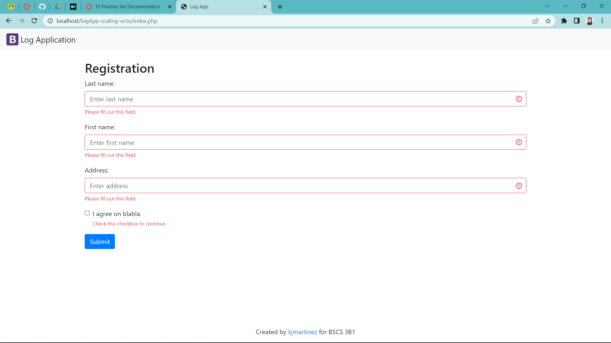
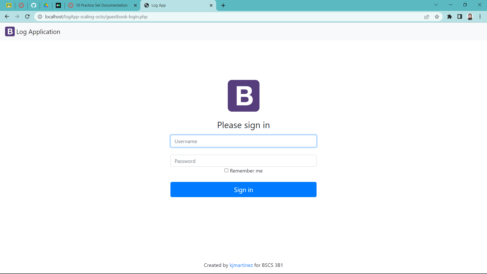
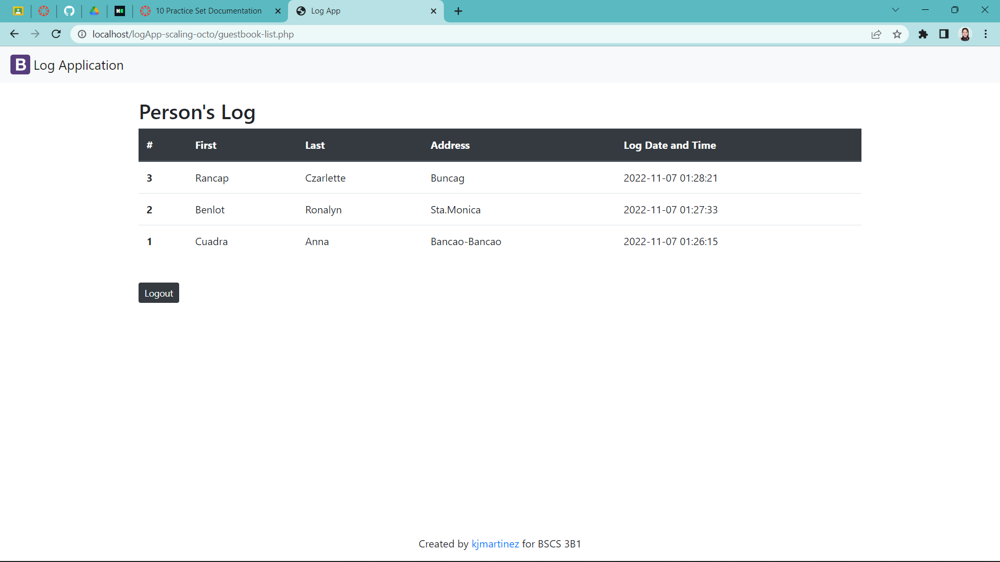
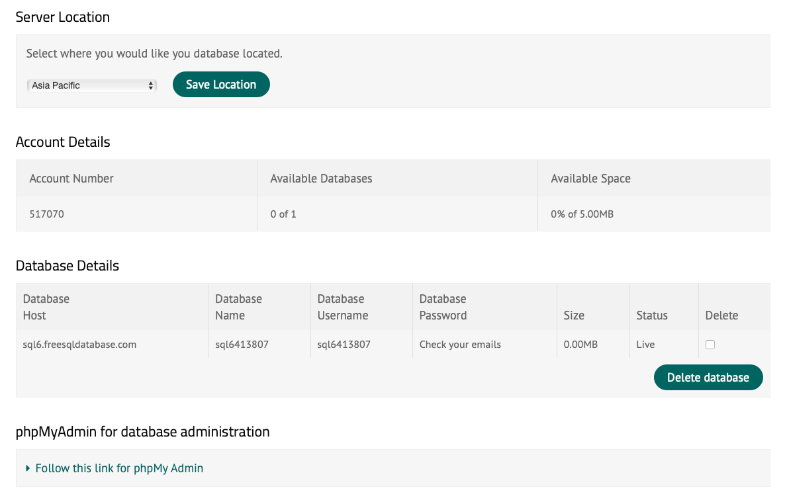

#### :space_invader: This is from Practice 5-06

# :space_invader:logApp-Cuadra:space_invader:

## Description
A logbook has played an important role, especially during the starting period of the pandemic. It records and tracks the people who come in and out of a specific establishment. We usually encounter it in malls, stores, schools, and almost everywhere. 
This logApp-scalling-octo repository, or **logApp**, is a sample application that has a *Registration Page* that logs the individual's personal information and the date and time he/she visits the place. To protect an individual's personal information **(RA 10173, Data Privacy Act of 2012)**, only users with an admin account or the *Administrators* can view the *Guest List* of individuals who visited the premises. The said application has also a *Logout* function.

## Visuals
Here are some example images of the application:
- Registration Page
  

  

- Administrator's Log In Page
  

  

- Guest List

## Installation
*In this application, we will be using a free web database server in **freesqldatabase**.

1. Watch the [PHP tutorials and XAMPP setup by Brad Traversy](https://www.youtube.com/watch?v=oJbfyzaA2QA&list=PLillGF-Rfqbap2IB6ZS4BBBcYPagAjpjn)"Tutorial"
2. Create an account at https://www.freesqldatabase.com
3. Log in to your account, create a database and take note your database details. It should look something like this.
   
4. Click the "Follow this link for phpMy Admin"
   Setup your database:
    - Create tables - PERSON(pid, lastname, firstname, address, logdt) and USERACCOUNT(uid,username, password)
    - Make sure to set logDT data type to TIMESTAMP and default value to CURRENT_TIMESTAMP
    - Add atleast one (1) row in USERACCOUNT table so you can test the Log In page
5. Open the file **config.php**, and modify the value set for **DB_HOST, DB_USER, DB_PASS, DB_NAME**
according to your Database details sent into your email

## Author

  Anna Margarita Cuadra